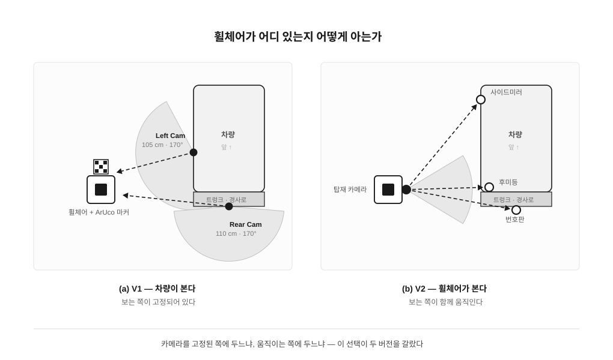
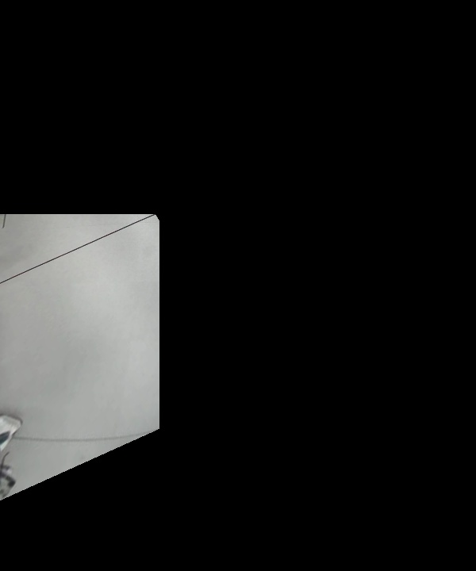
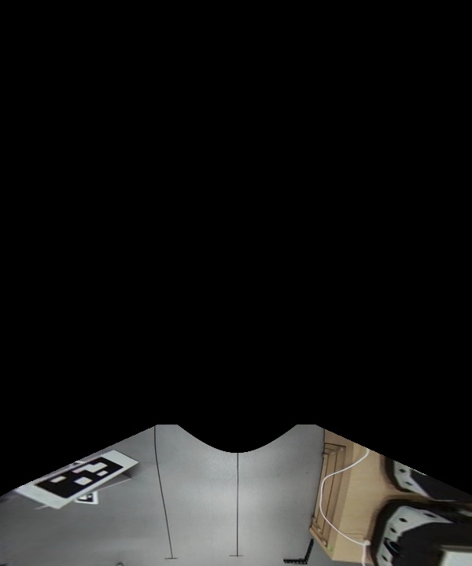
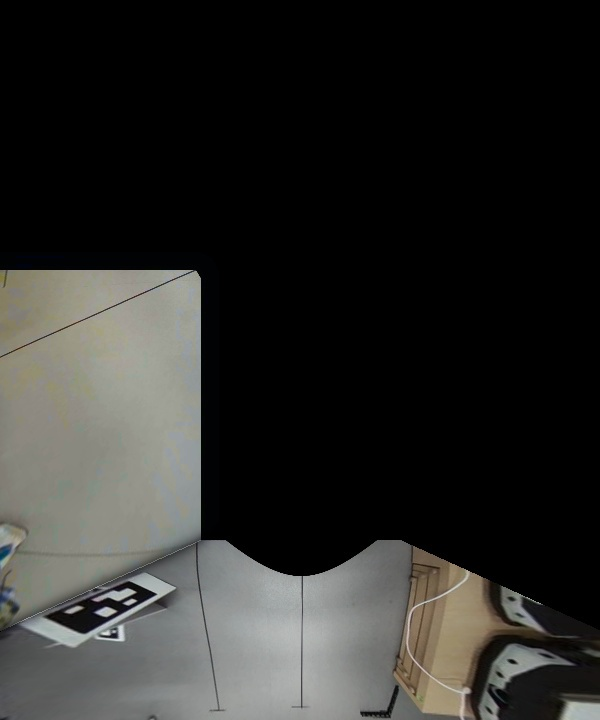
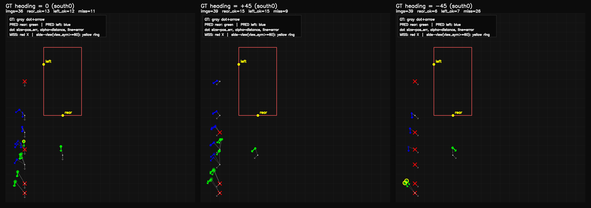
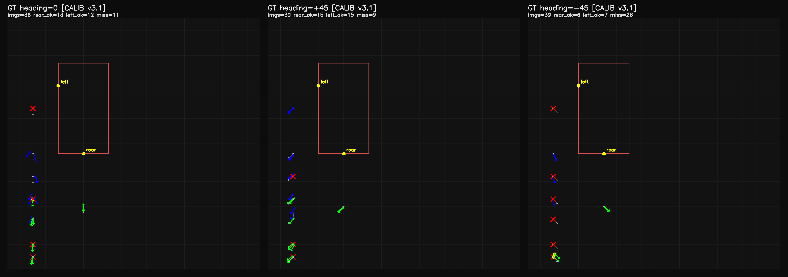
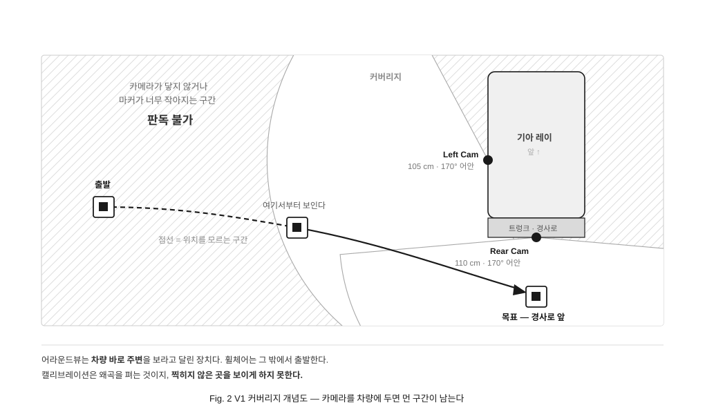
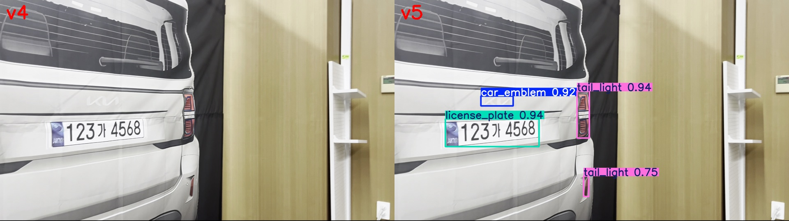
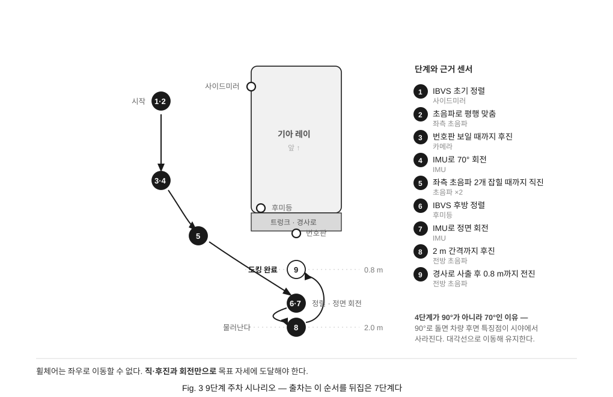

<div align="center">

# 전동휠체어 자동 주차 시스템

**전동휠체어 사용자가 차량 탑승 후, 남겨진 휠체어를 타인의 도움 없이 트렁크까지 자동 수납한다.**

[](https://www.python.org/)
[](https://opencv.org/)
[](https://docs.ultralytics.com/)
[](#-엣지-디바이스-검증-jetson-nano)
[]()

단국대학교 **배리어프리 ICT기술 연구센터(ITRC)** 과제 · 2025.12 ~ 진행 중

</div>

---

## 한눈에 보기

| | |
|---|---|
| **문제** | 전동휠체어 사용자는 차에 탄 뒤 남은 휠체어를 스스로 수납할 수 없다 |
| **접근** | 차량 부위를 시각으로 인식해 휠체어가 스스로 트렁크 앞 위치까지 정렬·이동 |
| **핵심 성과** | 자체 구축 데이터셋으로 차량 부위 6종 탐지 (**mAP50 최대 0.995**) · **단안 카메라만으로 거리·자세 추정** · **Jetson Nano에서 15 FPS 실시간 구동** |
| **실기체** | AgileX TRACER 섀시(CAN) · JUVO B4 전동휠체어(조이스틱 연동) |
| **특징** | 1차 접근이 구조적으로 실패한 원인을 규명하고 **아키텍처를 전면 전환**한 기록이 남아 있다 |

<br>

<div align="center">

</div>

---

---

## 1. 왜 이 문제인가

전동휠체어 사용자가 자가운전 차량을 이용할 때, **차에 타는 것보다 어려운 일은 남겨진 휠체어를 수납하는 것**이다.
지금은 누군가에게 의존해야 하고, 혼자 운전하는 사용자에게는 외출 자체의 제약이 된다.

**기아 레이(RAY) 기준으로, 휠체어가 스스로 트렁크 경사로 앞까지 이동해 수납·출차하는 것**이 목표다.

설계 원칙은 처음부터 **범용성**이었다.

- 추가 센서 장착을 최소화한다
- 특정 차량·휠체어 모델에 종속되지 않는다
- 차량에 이미 달려 있는 것(어라운드뷰 카메라)을 최대한 활용한다

이 원칙이 V1을 결정했고, **동시에 V1이 막힌 이유이기도 하다.**

---

## 2. 질문은 하나였다 — 휠체어가 어디 있는지 어떻게 아는가

세 버전 모두 이 질문 하나를 다르게 풀었다. 갈리는 축은 **카메라를 고정된 쪽에 두느냐, 움직이는 쪽에 두느냐**다.

| | **V1** (중단) | **V2** (진행 중) | **V3** (검토) |
|---|---|---|---|
| 카메라 위치 | **차량** — 어라운드뷰 2대 | **휠체어** — 탑재 카메라 | 없음 |
| 무엇을 보나 | 휠체어의 ArUco 마커 | 차량 부위 6종 (딥러닝) | 전파 (UWB) |
| 위치 추정 | 탑뷰 맵 좌표 | 번호판 실측 규격 기반 단안 | 거리 측정 ±10 cm |
| 제어 | A\* 경로계획 → CAN | IBVS + 초음파 + IMU → 조이스틱 |  |
| **막힌 곳** | **먼 구간이 안 보인다** | **하드웨어가 불어났다** |  |

**세 번 다 같은 축에서 막혔다 — 시야 의존.** V3는 그 축 자체를 없애는 방향이다.

### 담당 역할

3인 팀으로 진행했고 저장소 관리와 코드 통합을 담당하였다.

| | **V1** | **V2** |
|---|---|---|
| **이종하** | **휠체어 위치추정 전체** — 어안 캘리브레이션 · ArUco/SolvePnP · Ridge Regression 보정층 · 칼만 필터 | **인식·자세 추정 전체** — YOLOv8 데이터 구축·학습 · 단안 거리/yaw/bearing · IBVS 정렬 · IMU 회전각 보장 · Jetson 포팅 |
| 팀원 | A\* 경로계획 및 경로 추종 | 조이스틱 제어 하드웨어 |
| 공통 | 시나리오 설계 · 실기체 실험 | 시나리오 설계 · 실기체 실험 |

---

## 3. V1 — 차가 휠체어를 본다

차량에 이미 달린 어라운드뷰를 쓰면 **휠체어에 아무것도 달지 않아도 된다.** 원칙에 가장 충실한 선택이었다.

어안 카메라 2대를 캘리브레이션해 탑뷰를 합성하고, 휠체어에 붙인 25×25 cm ArUco 마커로 위치를 추정했다.

| 좌측 카메라 | 후방 카메라 | 합성 결과 |
|---|---|---|
|  |  |  |

### 잔차가 무작위가 아니었다

SolvePnP 결과를 그대로 쓰지 않았다. **출력 잔차가 거리·각도에 따라 체계적으로 편향된다**는 것을 확인하고 보정층을 학습으로 설계했다.

```
X = [1, g, g², b, b², v, g·b, reproj]     g 바닥거리(m) · b 화면 내 마커 각도(deg)
w* = argmin ‖Xw − y‖² + λ‖w‖²             v 마커가 카메라를 보는 각도 · reproj 재투영 오차(px)
```

여기에 전·후진 200 mm/s · 회전 0.3 rad/s 운동 모델의 칼만 필터를 얹어 시계열을 안정화했다.

| 맵 보정 전 | 보정 후 |
|---|---|
|  |  |

**8단계 파이프라인 중 7단계가 실기체에서 동작했다.** 캘리브레이션 → 탑뷰 합성 → 위치추정 → A\* 경로계획 → CAN 제어까지 이어졌다.

### 막힌 곳은 튜닝이 아니었다

<div align="center">

</div>

어라운드뷰는 **차량 바로 주변**을 보라고 달린 장치다. 그런데 휠체어는 그 밖에서 출발한다.
멀어질수록 마커가 화면에서 작아지고 렌즈 주변부로 밀려나, **캘리브레이션으로 메울 수 없는 구간이 남았다.**

보정을 아무리 정교하게 해도 소용없는 종류의 문제였다.

> **캘리브레이션은 왜곡을 펴는 것이지, 찍히지 않은 곳을 보이게 하지 못한다.**

그래서 **카메라를 움직이는 쪽에 실었다.** 대상까지의 거리가 항상 가까우면 이 문제 자체가 생기지 않는다.

---

## 4. V2 — 휠체어가 차를 본다

### 4-1. 공개 데이터셋이 안 통했다

공공 데이터셋으로 학습한 모델은 실차 영상에서 검출되지 않았다. **도메인 불일치를 자체 촬영·라벨링으로 해결**했다.

<div align="center">

<br><sub>도메인 데이터 추가 학습 전(v4, 좌)과 후(v5, 우). 같은 프레임에서 검출 0건 → 4건</sub>
</div>

| 버전 | 변경 | 결과 |
|---|---|---|
| `v1_merged` | 공공 5종 통합 | 번호판이 배경과 충돌해 억제됨 |
| `v2_ft` | 신형 번호판 fine-tune | plate 검출 **13 → 80 프레임** |
| `v3_ray` | 실차 도메인 데이터 추가 | 번호판 실영상 개선 |
| `v4_6cls` | 후미등 추가, 6클래스 재학습 | 아래 mAP50 |
| **`v5_poster`** | 실물크기 목업 60장 추가 | 포스터 환경 검출 **6배**, conf **0.26 → 0.89** |

자체 구축 라벨 — **실차 121장 + 실물크기 목업 60장**

| license_plate | car_emblem | door_handle | fuel_cap | tail_light | side_mirror |
|:---:|:---:|:---:|:---:|:---:|:---:|
| **.995** | **.974** | **.917** | .878 | .811 | .754 |

### 4-2. 번호판이 자가 된다

거리 센서 없이, **번호판 규격 335 × 155 mm가 국가 표준으로 고정되어 있다는 점**을 이용했다.

| 값 | 계산 | 제어에서의 의미 |
|---|---|---|
| **거리** | 핀홀 `D = H_real · f / h_px` | 얼마나 남았나 |
| **yaw** | 폭/높이 비율 `acos` + 꼭짓점 키스톤으로 부호 | 차가 얼마나 비스듬한가 |
| **bearing** | `atan((x_center − cx) / f)` | 차가 시야 어느 쪽인가 |

실영상 검증 — 실측 1.2 m 정면 → 추정 **1.20 m**, yaw ≈ 0

### 4-3. 9단계 주차

<div align="center">

</div>

거리 센서 하나로 끝나지 않는다. **카메라(IBVS) · 초음파 · IMU가 단계마다 번갈아 기준이 된다** —
시야로 맞출 수 있는 곳은 카메라가, 각도는 IMU가, 간격은 초음파가 담당한다.

### 4-4. 캐스터 휠 — 관측할 수 없는 상태

전동휠체어 앞바퀴는 **캐스터 휠(자유 회전)**이다. 직진 명령을 줘도 **바퀴가 이전에 틀어져 있던 방향으로 휘어 나간다.** 그리고 그 틀어짐을 읽을 센서가 없다.

관측 불가능한 상태를 추정하는 대신 **결과를 직접 측정하는 쪽**을 택했다. IMU로 실제 회전각을 읽어 목표에 도달할 때까지 보정하면, 바퀴 정렬과 무관하게 회전이 보장된다.

> 이 문제는 V1에서 이미 나타났다. 카메라를 옮긴다고 사라지는 문제가 아니었다.

### 4-5. Jetson Nano 4GB

휠체어에 실을 컴퓨터라는 제약 위에서 설계했으므로 탑재 가능성을 측정했다.

| 처리 속도 | 프레임당 추론 | RAM | GPU | 전력 | 온도 |
|---|---|---|---|---|---|
| **지속 15 FPS** (최대 22) | 42 ms | **3.55 / 3.96 GB** | 평균 35% | 5.8 W | 47~49 ℃ (팬 없음) |

모델 로드 구간에서 시스템이 프리징했는데, 원인이 스왑 부족(512 MB)임을 확인하고 4 GB로 확장해 해소했다.

---

## 5. 결과와 한계

| | |
|---|---|
| 차량 부위 6종 탐지 | mAP50 **0.995 ~ 0.754** |
| 자체 구축 라벨 | 실차 **121장** + 목업 **60장** |
| 도메인 학습 효과 | 검출 프레임 **6배**, conf **0.26 → 0.89** |
| 단안 거리 추정 | 실측 1.2 m → 추정 **1.20 m** |
| 엣지 실시간성 | Jetson Nano **15 FPS** / 5.8 W |
| V1 파이프라인 | 8단계 중 **7단계 실기체 동작** |
| 실기체 | AgileX TRACER (CAN) · JUVO B4 전동휠체어 |

### 단계마다 남은 문제

시나리오는 끝까지 돌지만, 각 단계가 기대는 가정이 다르고 그중 몇은 아직 약하다.

| 단계 | 남은 문제 |
|---|---|
| 1. IBVS 초기 정렬 | 좌우로 진동하며 특징을 매칭하지 못하는 구간이 있다. YOLO를 올리며 메모리가 1 GB 늘어 **3.6 / 4 GB**까지 찼다 |
| 2. 초음파 평행 | 횡방향 간격은 잡히지만 **x축 정렬은 IBVS 오차가 크다** |
| 3 · 5 · 8. 직·후진 | 캐스터 휠 정렬에 따라 이동 방향이 휜다 (회전만 IMU로 보장) |
| 4. 70° 회전 | **고정값이라** 시작 위치가 달라지면 따라가지 못한다 |
| 6. IBVS 후방 정렬 | 좌측 초음파 2개 간격이 짧고 완전한 후방이 아니라 매번 같은 위치로 수렴하지 않는다 |
| 7. IMU 정면 회전 | 전방 초음파가 하나뿐이라 평행 여부를 알 수 없어 IMU 오차가 그대로 남는다 |

### V3 — 보지 않는 쪽으로

위 목록에서 **1·2·6은 시야에 의존하는 정렬**이고, **3·5·8은 관측 불가능한 바퀴 상태**에서 비롯된다.
개별 단계를 튜닝하는 대신 **시야에 의존하지 않는 측위**로 바꾸면 상당수가 함께 사라진다.

**UWB**를 검토 중이다 — 오차 ±10 cm, 현대·기아가 디지털키에 이미 상용화, 카메라 대비 설치 위치·각도 제약이 적다.
시각 정보는 마지막 정밀 정렬에만 쓰는 구조다.

> **현재 조사와 장비 구매까지 진행했다. 실험은 시작하지 않았다.**

---

## 문서

| | |
|---|---|
| [V2 모델 학습 이력](src/v2_vision/README.md) | v1 → v5 학습 기록 |
| [거리추정 정리](src/v2_vision/거리추정_정리.md) | 핀홀 · yaw · bearing 유도 |
| [Jetson 부하 테스트](src/v2_vision/jetson_부하테스트_보고서.md) | 전체 측정 기록 |
| [세그멘테이션 실험](src/v2_vision/seg_experiment/RESULTS.md) | 대안 검토 |
| [V1 전체 정리](src/v1_aroundview/NOTES.md) | 8단계 파이프라인 |
| [발표자료](files/) | 0301 · 0821 · 0901 |

**실행** — Python 3.10 (`ultralytics`, `opencv-python`)

```bash
cd src/v2_vision
python3.10 scripts/test_video.py raw_videos/레이영상_1.mov models/best_v5_poster.pt      # 부위 탐지
python3.10 scripts/distance_video.py raw_videos/레이영상_1.mov models/best_v4_6cls.pt   # 거리·자세 HUD
cd jetson_nano && python3 main.py                                                        # Jetson 실시간
```

> 100 MB 초과 결과 영상·데이터셋 원본 18개(약 3.8 GB)는 GitHub 용량 제한으로 제외했다(`.gitignore`에 목록 명시).
