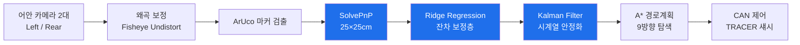
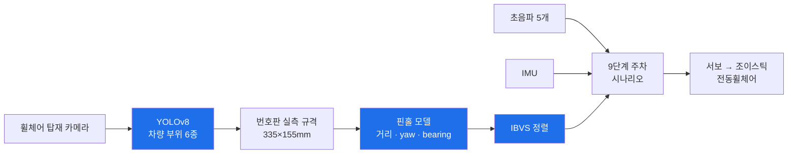

<div align="center">

# 전동휠체어 자동 주차 시스템

**전동휠체어 사용자가 차량 탑승 후, 남겨진 휠체어를 타인의 도움 없이 트렁크까지 자동 수납한다.**

[](https://www.python.org/)
[](https://opencv.org/)
[](https://docs.ultralytics.com/)
[](#-엣지-디바이스-검증-jetson-nano)
[]()

단국대학교 **배리어프리 ICT기술 연구센터(ITRC)** 과제 · 2025.12 ~ 진행 중

</div>

---

## 한눈에 보기

| | |
|---|---|
| **문제** | 전동휠체어 사용자는 차에 탄 뒤 남은 휠체어를 스스로 수납할 수 없다 |
| **접근** | 차량 부위를 시각으로 인식해 휠체어가 스스로 트렁크 앞 위치까지 정렬·이동 |
| **핵심 성과** | 자체 구축 데이터셋으로 차량 부위 6종 탐지 (**mAP50 최대 0.995**) · **단안 카메라만으로 거리·자세 추정** · **Jetson Nano에서 15 FPS 실시간 구동** |
| **실기체** | AgileX TRACER 섀시(CAN) · JUVO B4 전동휠체어(조이스틱 연동) |
| **특징** | 1차 접근이 구조적으로 실패한 원인을 규명하고 **아키텍처를 전면 전환**한 기록이 남아 있다 |

<br>


> 도메인 데이터 추가 학습 전(v4, 좌)과 후(v5, 우). 같은 프레임에서 검출 0건 → 4건.

---

## 목차

1. [왜 이 문제인가](#1-왜-이-문제인가)
2. [담당 역할](#2-담당-역할)
3. [시스템 아키텍처](#3-시스템-아키텍처)
4. [V1 → V2: 접근을 바꾼 이유](#4-v1--v2-접근을-바꾼-이유)
5. [V1 — 어라운드뷰 기반 휠체어 위치추정](#5-v1--어라운드뷰-기반-휠체어-위치추정)
6. [V2 — 휠체어 탑재 카메라 기반 자율 정렬](#6-v2--휠체어-탑재-카메라-기반-자율-정렬)
7. [결과 요약](#7-결과-요약)
8. [저장소 구조](#8-저장소-구조)
9. [실행 방법](#9-실행-방법)
10. [한계와 다음 단계](#10-한계와-다음-단계)

---

## 1. 왜 이 문제인가

전동휠체어 사용자가 자가운전 차량을 이용할 때, **차에 타는 것보다 어려운 일은 남겨진 휠체어를 수납하는 것**이다. 현재는 활동지원사나 동승자의 도움에 의존해야 하고, 혼자 운전하는 사용자에게는 사실상 외출 자체의 제약이 된다.

이 프로젝트는 **기아 레이(RAY) 자가운전 차량**을 기준으로, 전동휠체어가 스스로 트렁크 경사로 앞까지 이동해 수납·출차하는 시스템을 목표로 한다.

설계 원칙은 **범용성**이었다.

- 추가 센서 장착을 최소화한다
- 특정 차량·휠체어 모델에 종속되지 않는다
- 차량에 이미 달려 있는 것(어라운드뷰 카메라)을 최대한 활용한다

이 원칙이 V1의 설계를 결정했고, 동시에 V1이 실패한 이유이기도 하다.

---

## 2. 담당 역할

3인 팀(이종하 · 구선주 · 정지욱)으로 진행했으며 **저장소 관리와 코드 통합을 이종하가 담당**했다. 따라서 커밋 이력이 한 계정에 몰려 있으나 실제 기여는 아래와 같다.

| | **V1** (어라운드뷰) | **V2** (휠체어 탑재 카메라) |
|---|---|---|
| **이종하** | **휠체어 위치추정 전체**<br>어안 캘리브레이션 · ArUco/SolvePnP · **Ridge Regression 보정층** · **칼만 필터** | **인식 및 자세 추정 전체**<br>YOLOv8 데이터 구축·학습 · **단안 거리/yaw/bearing 추정** · **IBVS 정렬** · **IMU 회전각 보장** · Jetson 포팅 |
| 팀원 | A\* 경로계획 및 경로 추종 | 조이스틱 제어 하드웨어 |
| 공통 | 시나리오 설계 · 실기체 실험 | 시나리오 설계 · 실기체 실험 |

---

## 3. 시스템 아키텍처

### V1 — 차량에서 휠체어를 본다



### V2 — 휠체어에서 차량을 본다



> 파란 블록이 본인이 설계·구현한 부분.

---

## 4. V1 → V2: 접근을 바꾼 이유

| | **V1** (중단) | **V2** (진행 중) |
|---|---|---|
| 카메라 위치 | **차량**에 어라운드뷰 2대 (Left/Rear) | **휠체어**에 탑재 |
| 인식 대상 | 휠체어에 부착한 ArUco 마커 | 차량 부위를 딥러닝으로 직접 탐지 |
| 위치 추정 | 어라운드뷰 탑뷰 맵 좌표 | 번호판 실측 규격 기반 단안 추정 |
| 제어 | A\* 경로계획 → CAN (TRACER) | IBVS + 초음파 + IMU → 조이스틱 |
| 코드 | [`src/v1_aroundview/`](src/v1_aroundview/) | [`src/v2_vision/`](src/v2_vision/) |

**V1은 실패한 게 아니라 한 칸을 남기고 막혔다.** 캘리브레이션 → 어라운드뷰 합성 → 위치추정 → A\* 경로계획 → CAN 제어까지 파이프라인 7단계가 실기체에서 동작했다. 마지막 단계인 맵 캘리브레이션에서, **어안 렌즈 주변부 왜곡으로 추정 각도가 순간적으로 튀는 현상**을 잡지 못했다.

Ridge Regression 보정층과 칼만 필터로 잔차를 줄였지만 한계가 있었다. 원인을 추적한 결과, 문제는 튜닝이 아니라 구조에 있었다.

> **"차량에 고정된 카메라로 넓은 영역을 왜곡 보정해서 본다"**
> — 이 구조 자체가 오차의 근원이었다.

넓은 시야를 얻으려면 어안 렌즈가 필요하고, 어안은 주변부 왜곡이 크며, 휠체어는 정확히 그 주변부에서 움직였다. 보정을 아무리 정교하게 해도 원리적으로 남는 오차였다.

그래서 **카메라를 휠체어에 싣고, 차량을 직접 인식하는 구조**로 전환했다. 대상이 가까워지고 화면 중앙에 오면서 왜곡 문제 자체가 사라졌다.

---

## 5. V1 — 어라운드뷰 기반 휠체어 위치추정

### 어라운드뷰 합성

어안 카메라 2대를 캘리브레이션하고 원근 변환으로 탑뷰를 합성했다.

| 좌측 카메라 | 후방 카메라 | 합성 결과 |
|---|---|---|
|  |  |  |

카메라 배치 (실측):

| | 좌표 | 높이 | 렌즈 |
|---|---|---|---|
| Left Cam | (200, 270) | 105 cm | 170° 광각 |
| Rear Cam | (300, 540) | 110 cm | 170° 광각 |

### 3단 자세 추정 파이프라인

단순히 SolvePnP 결과를 쓰지 않았다. **PnP 출력의 잔차가 무작위가 아니라 거리·각도에 따라 체계적으로 편향된다**는 것을 확인하고, 보정층을 학습 기반으로 설계했다.

**Step 1 — SolvePnP**
왜곡 보정된 코너 좌표에 25×25cm 마커 규격을 적용해 `tvec`(3D 위치), `rvec`(회전) 추출

**Step 2 — Ridge Regression 잔차 보정**

```
X = [1, g, g², b, b², v, g·b, reproj]

  g      바닥 거리 (m)
  b      화면 내 마커 각도 (deg)
  v      마커가 카메라를 바라보는 각도 (deg)
  reproj PnP 재투영 오차 (px)

w* = argmin ‖Xw − y‖² + λ‖w‖²
```

거리가 멀수록, 마커가 비스듬할수록, 재투영 오차가 클수록 편향이 커지는 패턴을 특징으로 넣어 보정값을 회귀했다.

**Step 3 — Kalman Filter**
전·후진 200 mm/s, 회전 0.3 rad/s의 운동 모델로 시계열 안정화

### 맵 보정 전후

| 보정 전 | 보정 후 |
|---|---|
|  |  |

파이프라인은 [`01_calibration`](src/v1_aroundview/01_calibration/) → [`08_parking`](src/v1_aroundview/08_parking/)까지 단계별로 정리되어 있다.

---

## 6. V2 — 휠체어 탑재 카메라 기반 자율 정렬

### 차량 부위 6종 탐지 모델

공공 데이터셋만으로는 실차 영상에서 검출이 되지 않았다. **도메인 불일치를 자체 촬영·라벨링으로 해결**했다.

| 버전 | 변경 | 결과 |
|---|---|---|
| `v1_merged` | 공공 5종 통합 | 번호판이 배경과 충돌해 억제됨 |
| `v2_ft` | 신형 번호판 fine-tune | 레이 영상 plate 검출 **13 → 80 프레임** |
| `v3_ray` | 실차 도메인 데이터 추가 | 번호판 실영상 개선 |
| `v4_6cls` | 후미등 추가, 6클래스 재학습 | 아래 mAP50 |
| **`v5_poster`** ★ | 실물크기 목업 60장 추가 | 포스터 환경 plate 검출 **6배**, conf **0.26 → 0.89** |

**자체 구축 데이터**: 실차 라벨 121장 + 실물크기 목업 라벨 60장

**val mAP50 (v4 기준)**

| license_plate | car_emblem | door_handle | fuel_cap | tail_light | side_mirror |
|:---:|:---:|:---:|:---:|:---:|:---:|
| **.995** | **.974** | **.917** | .878 | .811 | .754 |

### 단안 카메라 거리·자세 추정

거리 센서 없이, **번호판의 실측 규격(335 × 155 mm)이 국가 표준으로 고정되어 있다는 점**을 이용해 도킹 제어에 필요한 3요소를 뽑았다.

| 값 | 계산 | 제어에서의 의미 |
|---|---|---|
| **거리** (m) | 핀홀 모델 `D = H_real · f / h_px` | 얼마나 남았나 |
| **yaw** (deg, ±) | 폭/높이 비율 `acos` + 꼭짓점 키스톤으로 부호 판별 | 차가 얼마나 비스듬한가 → 접근 자세 |
| **bearing** (deg, ±) | `atan((x_center − cx) / f)` | 차가 시야 어느 쪽인가 → 조향 |

실영상 검증: 실측 1.2 m 정면 → 추정 **1.20 m**, yaw ≈ 0

### 9단계 주차 시나리오

휠체어는 좌우 이동이 불가능해, 직·후진과 회전만으로 목표 자세에 도달해야 한다.

```
1. IBVS 초기 위치 정렬 (사이드미러)      6. IBVS 후방 위치 정렬 (후미등)
2. 초음파로 차량과 평행 맞춤             7. IMU로 정면 회전
3. 번호판 보일 때까지 후진               8. 초음파로 2 m 간격 후진
4. 번호판 포착 시 IMU로 70° 회전         9. 경사로 사출 시 0.8 m까지 전진
5. 좌측 초음파 2개 잡힐 때까지 직진
```

4단계에서 90°가 아닌 **70°를 쓴 이유**: 90° 회전 시 카메라에 차량 후면 특징점이 잡히지 않아, 대각선으로 이동하며 특징점을 유지하도록 각도를 조정했다.

### 단계별로 아직 남은 문제

시나리오는 끝까지 돌지만, 각 단계가 기대는 가정이 다르고 그중 몇 개는 아직 약하다.

| 단계 | 남은 문제 |
|---|---|
| 1. IBVS 초기 정렬 | 실제 구현에서 좌우로 진동하며 이미지 특징을 매칭하지 못하는 구간이 있다. YOLO를 올리며 메모리가 1 GB 늘어 **3.6 GB / 4 GB**까지 찼다 |
| 2. 초음파 평행 맞춤 | 횡방향 간격은 초음파로 판단되지만, **x축 정렬은 IBVS 오차가 크다** |
| 3 · 5 · 8. 직·후진 | 캐스터 휠 정렬 상태에 따라 이동 방향이 휜다 (아래 IMU 보완으로 회전만 보장) |
| 4. 70° 회전 | **70°가 고정값이라** 시작 위치가 달라지면 따라가지 못한다 |
| 6. IBVS 후방 정렬 | 좌측 초음파 2개의 간격이 짧고 완전한 후방에 있지 않아, 매번 같은 위치로 수렴하지 않는다 |
| 7. IMU 정면 회전 | 전방 초음파가 하나뿐이라 평행 여부를 알 수 없어 IMU에 의존한다. IMU 자체 오차가 그대로 남는다 |

**이 목록이 V3(UWB 측위)를 검토하는 이유다.** 1·2·6은 시야에 의존하는 정렬이고, 3·5·8은 관측 불가능한 바퀴 상태에서 비롯된다. 개별 단계를 튜닝하는 대신 **시야에 의존하지 않는 측위**로 바꾸면 상당수가 함께 사라진다.

### 캐스터 휠 문제와 IMU 보완

전동휠체어의 앞바퀴는 **캐스터 휠(자유 회전)**이다. 직진 명령을 줘도 **바퀴가 이전에 틀어져 있던 방향으로 휘어서 나간다.** 그리고 그 틀어짐을 관측할 센서가 없다.

관측 불가능한 상태를 추정하는 대신, **결과를 직접 측정하는 쪽**을 택했다. IMU로 실제 회전각을 읽어 목표 각도에 도달할 때까지 보정하는 방식으로, 바퀴 정렬 상태와 무관하게 회전을 보장했다.

### 엣지 디바이스 검증 (Jetson Nano)

휠체어에 실을 컴퓨터라는 제약 위에서 설계했으므로, 실제 탑재 가능성을 측정했다.

| 항목 | 측정값 |
|---|---|
| 처리 속도 | **지속 15 FPS** (최대 22) |
| 프레임당 추론 | 42 ms |
| RAM | 3.55 / 3.96 GB |
| GPU | 평균 35% |
| 소비 전력 | 평균 5.8 W |
| 온도 | 47~49 ℃ (팬 없음) |

> **판정: 실시간 구동 가능.** 초기 테스트에서 모델 로드 구간에 시스템이 프리징했는데, 원인이 스왑 부족(512 MB)임을 확인하고 4 GB로 확장해 해소했다.

전체 측정 기록: [`jetson_부하테스트_보고서.md`](src/v2_vision/jetson_부하테스트_보고서.md)

---

## 7. 결과 요약

| | |
|---|---|
| 차량 부위 6종 탐지 | mAP50 **0.995 ~ 0.754** |
| 자체 구축 라벨 데이터 | 실차 **121장** + 목업 **60장** |
| 도메인 학습 효과 | 포스터 환경 검출 프레임 **6배**, conf **0.26 → 0.89** |
| 단안 거리 추정 | 실측 1.2 m → 추정 **1.20 m** |
| 엣지 실시간성 | Jetson Nano **15 FPS** / 5.8 W |
| V1 파이프라인 | 8단계 중 **7단계 실기체 동작** |
| 실기체 | AgileX TRACER (CAN) · JUVO B4 전동휠체어 |

---

## 8. 저장소 구조

```
├── src/
│   ├── v1_aroundview/          # V1 — 8단계 파이프라인
│   │   ├── 01_calibration/     #   어안 캘리브레이션
│   │   ├── 02_aroundview/      #   탑뷰 합성
│   │   ├── 03_localization/    #   ArUco 위치추정
│   │   ├── 04_planning/        #   A* 경로계획
│   │   ├── 05_hardware/        #   CAN 통신 (TRACER)
│   │   ├── 06_angle_tunning/   #   각도 튜닝 UI
│   │   ├── 07_map_calibration/ #   맵 보정 (미해결 지점)
│   │   └── 08_parking/         #   수동 조종
│   └── v2_vision/              # V2 — 탐지 + 거리추정
│       ├── models/             #   학습 모델 v1~v5
│       ├── scripts/            #   추론·거리추정·파인튜닝
│       ├── my_data/labeled/    #   자체 라벨 데이터
│       ├── seg_experiment/     #   세그멘테이션 실험
│       ├── jetson_nano/        #   엣지 배포 (카메라 + ESP32)
│       └── outputs/            #   결과 영상·이미지
└── files/                      # 발표자료, 참고문헌, 3D 모델, 포스터
```

**상세 문서**
[V2 모델 학습 이력](src/v2_vision/README.md) ·
[거리추정 정리](src/v2_vision/거리추정_정리.md) ·
[Jetson 부하 테스트](src/v2_vision/jetson_부하테스트_보고서.md) ·
[세그멘테이션 실험](src/v2_vision/seg_experiment/RESULTS.md) ·
[V1 전체 정리](src/v1_aroundview/NOTES.md)

---

## 9. 실행 방법

**요구사항** — Python 3.10 (`ultralytics`, `opencv-python`)

**차량 부위 탐지**
```bash
cd src/v2_vision
python3.10 scripts/test_video.py raw_videos/레이영상_1.mov models/best_v5_poster.pt
```

**거리·자세 추정 (HUD 오버레이)**
```bash
cd src/v2_vision
python3.10 scripts/distance_video.py raw_videos/레이영상_1.mov models/best_v4_6cls.pt --conf 0.15
# 결과: outputs/distance/<영상>_dist.mp4
```

**Jetson Nano 실시간 구동** — 카메라(YOLO) + 초음파/서보 통합
```bash
cd src/v2_vision/jetson_nano
pip install -r requirements.txt
python3 main.py
```

**V1 파이프라인 재현**
```bash
cd src/v1_aroundview
pip install -r requirements.txt
```

> 100 MB를 초과하는 결과 영상·데이터셋 원본 18개(약 3.8 GB)는 GitHub 용량 제한으로 제외했다(`.gitignore`에 목록 명시). 재현에 필요한 스크립트와 학습 노트북은 모두 포함되어 있다.

---

## 10. 한계와 다음 단계

**현재 한계**

- 4단계의 70° 회전은 고정값이라, 시작 위치가 바뀌면 유동적으로 대응하지 못한다
- 초음파 센서 배치상 좌측 후방이 휠체어 완전 후방에 있지 않아, 매번 동일한 위치로 정렬되지 않는다
- 카메라 시야를 벗어나는 구간에서는 상태 관측이 끊긴다

**V3 방향 — UWB 기반 측위**

관측 불가 구간이 남는 근본 원인은 **시각 정보에만 의존한다는 것**이다. V1의 어안 왜곡, V2의 시야 이탈 모두 같은 뿌리다. 다음 버전에서는 **UWB 센서로 시야와 무관한 절대 위치를 확보**하고, 시각 정보는 정밀 정렬 단계에서만 사용하는 구조를 검토하고 있다.

---

<div align="center">

**이종하** · [GitHub](https://github.com/bell-ha) · [Portfolio](https://bell-ha.github.io)

</div>
