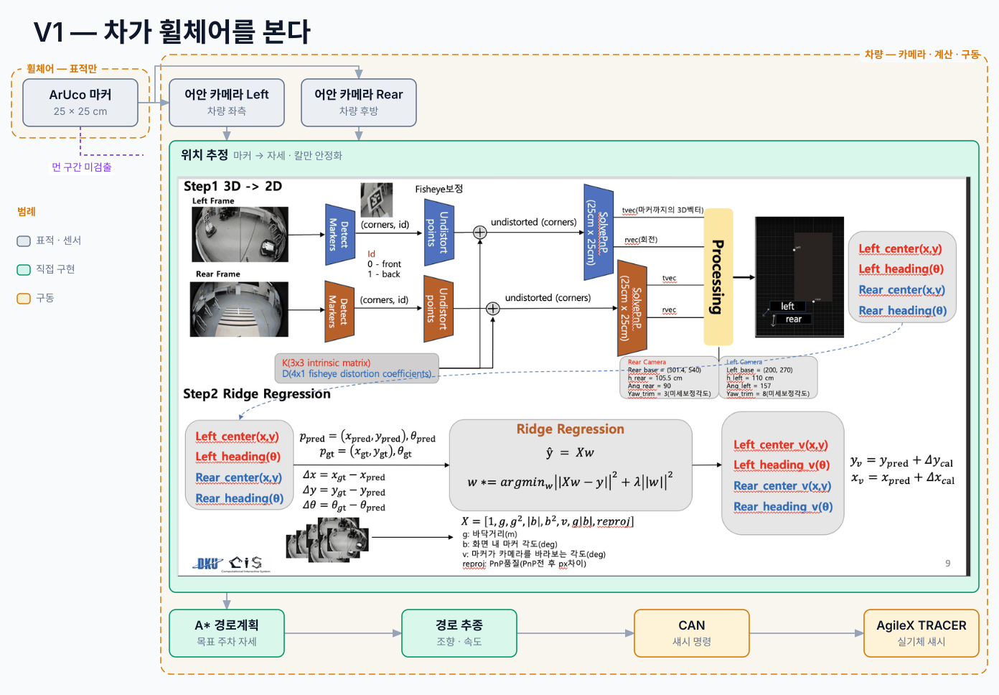
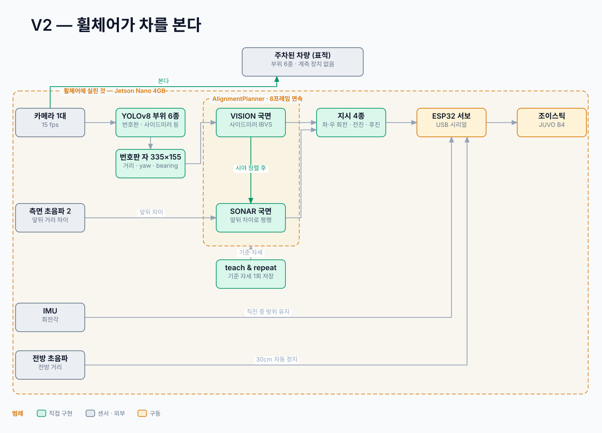
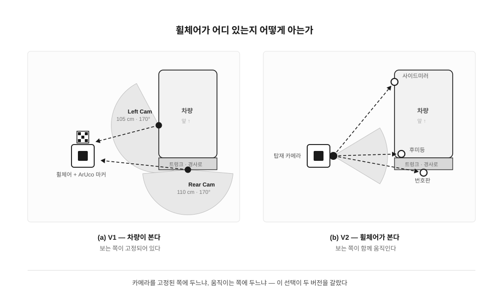

<div align="center">

# 전동휠체어 자동 주차 시스템

운전하는 사용자를 위한 전동휠체어 적재

[](https://www.python.org/)
[](https://opencv.org/)
[](https://docs.ultralytics.com/)
[](#하드웨어-최적화)

2025.12 ~ 진행 중 · 3인 팀 · 위치추정과 인식, 통합 담당 · ITRC 과제

</div>

---

## Impact

| | |
|---|---|
| **카메라를 옮긴 재설계** | 먼 구간이 안 찍혀 전면 개편 · 차량 어라운드뷰 → 휠체어 탑재 |
| **직접 구성한 데이터** | 실차 121장 · 목업 60장 직접 라벨링 · 차량 부품 6종, 번호판을 자로 활용 |
| **IMU로 회전 보정** | 앞바퀴가 캐스터라 틀어짐을 못 읽어, 각도 대신 회전속도를 맞춰 진동 제거 |
| **하드웨어 최적화** | 디코딩이 코어 하나를 91% 점유 · 갱신 주기 분리로 4 → 15 FPS 향상 |

---

## Background

전동휠체어 사용자는 차량에 탑승한 뒤, 밖에 남겨진 휠체어를 스스로 실을 수 없습니다.
이 과정에는 반드시 타인의 도움이 필요하고, 혼자 운전하는 사용자에게는 외출 자체의 제약이 됩니다.

본 연구에서는 **기아 RAY 자가운전 차량을 기준으로, 휠체어가 스스로 트렁크까지 가서
주차 및 출차하는 시스템**을 제안합니다.

설계 원칙은 처음부터 **범용성**이었습니다.

- 추가 센서 장착을 최소화한다
- 특정 차량·휠체어 모델에 종속되지 않는다
- 차량에 이미 달려 있는 것(어라운드뷰 카메라)을 최대한 활용한다

| | **V1** (중단) | **V2** (진행 중) | **V3** (검토) |
|---|---|---|---|
| 카메라 위치 | **차량** — 어라운드뷰 2대 | **휠체어** — 탑재 카메라 | 없음 |
| 무엇을 보나 | 휠체어의 ArUco 마커 | 차량 부위 6종 (딥러닝) | 전파 (UWB) |
| 위치 추정 | 탑뷰 맵 좌표 | 번호판 실측 규격 기반 단안 | 거리 측정 ±10 cm |
| 제어 | A\* 경로계획 → CAN | IBVS + 초음파 + IMU → 조이스틱 | |
| **막힌 곳** | **먼 구간이 안 보인다** | **하드웨어가 불어났다** | |

---

## Architecture

### V1 — 차가 휠체어를 본다

<div align="center">

</div>

### V2 — 휠체어가 차를 본다

<div align="center">

</div>

---

## Contributions

근거와 수식, 측정 전문은 [설계 노트](docs/DESIGN.md)에 있습니다.

### V1 — 차량 카메라로 위치 추정

차량에 장착되어 있는 어라운드뷰 카메라로 휠체어의 ArUco 마커를 보고 위치를 추정합니다.
휠체어에 아무것도 달지 않아도 되는, 범용성 원칙에 가장 충실한 선택이었습니다.

- 어안 왜곡을 편 뒤 SolvePnP로 마커까지의 위치와 회전을 구함
- 오차가 거리와 각도에 따라 일정한 방향으로 치우쳐, 그 편향을 학습으로 상쇄하는 보정층을 설계
- 칼만 필터로 시계열을 안정화

**8단계 파이프라인 중 7단계가 실기체에서 동작했습니다.**
캘리브레이션 → 탑뷰 합성 → 위치추정 → A\* 경로계획 → CAN 제어까지 이어졌습니다.

<div align="center">
<a href="https://youtu.be/o30saxUv7JM">

</a>
<br><sub>어안 2뷰(좌·후방)로 마커를 추적하고 탑뷰 맵에 위치를 찍는다 · <a href="https://youtu.be/o30saxUv7JM">youtu.be/o30saxUv7JM</a></sub>
</div>

### V2 — 휠체어 카메라로 위치 추정

휠체어에 실은 카메라로 차량의 특징을 봅니다.
공개 데이터셋이 실차에서 듣지 않아 직접 촬영하고 라벨링해 학습시켰습니다.

- 번호판, 엠블럼, 손잡이, 주유구, 후미등, 사이드미러 **부위 6종을 개별 탐지**
- **번호판을 기준 자로** 삼아 거리를 추정 — 335 × 155 mm가 국가 표준으로 고정되어 있음
- 목업을 학습시킨 뒤 **검출이 6배 증가**

<div align="center">

<br><sub>도메인 데이터 추가 학습 전(좌)과 후(우). 같은 프레임에서 검출 0건 → 4건</sub>
</div>

### 두 가지 센서로 정렬

사이드미러로 시야를 맞춘 뒤, 초음파로 평행을 맞춥니다.
한 센서로 끝까지 가지 않고 **구간마다 기준을 넘깁니다.**

- **VISION** — 사이드미러의 화면 위치와 크기를 목표 자세에 맞춤
- **SONAR** — 측면 초음파 앞뒤 거리 차이로 차량과 평행하게
- 두 국면 모두 **여덟 프레임 연속** 허용범위여야 다음으로 넘어감

<div align="center">

</div>

### 하드웨어 최적화

휠체어에 장착할 컴퓨터라는 제약에서 출발해 **Jetson Nano 4GB**에 얹었습니다.
4 FPS에 머물던 것을 지속 15 FPS, 프레임당 추론 42 ms로 끌어올렸습니다.

- 카메라를 30 fps로 받으면 디코딩 스레드가 **코어 하나를 91% 점유**해 추론이 쓸 CPU를 뺏음
- 카메라를 15 fps로 낮추고 화면 갱신을 10 Hz로 분리
- 모델 로드 중 프리징은 스왑 부족이어서 4 GB로 확장

| 처리 속도 | 프레임당 추론 | RAM | GPU | 전력 | 온도 |
|---|---|---|---|---|---|
| **지속 15 FPS** (최대 22) | 42 ms | 3.55 / 3.96 GB | 평균 35% | 5.8 W | 47~49 ℃ (팬 없음) |

---

## Troubleshooting

### 튜닝으로 풀 문제와 설계를 바꿔야 하는 문제

- **문제** 먼 구간의 오차가 줄지 않음. 보정을 더해도 그대로
- **원인** 거리가 멀어 그 구간이 아예 찍히지 않음. 파라미터로 풀 문제가 아니었음
- **해결** 마커를 키울 수도, 보정으로 메울 수도 없음. 그 근거로, 카메라를 휠체어로 옮기자고 제안
- **결과** V1에서 V2로 설계를 바꿈. 경로 생성은 그대로 쓸 수 있음. 팀원 작업은 영향 없음

> **캘리브레이션은 왜곡을 펴는 것이지, 찍히지 않은 곳을 보이게 하지 못합니다.**

<div align="center">

<br><sub>카메라를 고정된 쪽(차량)에 두느냐, 움직이는 쪽(휠체어)에 두느냐</sub>
</div>

### 직진 중 좌우로 진동

- **문제** 직진 명령을 줘도 똑바로 못 감. 좌우로 흔들림
- **원인** 앞바퀴가 캐스터라 이전 방향으로 휨. 그 틀어짐을 읽을 센서가 없음. IMU로 각도를 재 P제어로 되돌림. 방위오차가 1.2°인데 자이로는 −17.7°/s. 도착 순간 브레이크가 없어 반대로 넘어감
- **해결** 각도로 목표 회전속도를 정함. 자이로가 그 속도를 맞추는 구조로 교체. 적분항이 캐스터의 틀어짐을 주행 중 학습
- **결과** 가까울수록 스스로 감속. 50° 벗어난 상태에서 약 7초에 복귀

### Jetson Nano에서 프리징

- **문제** 추론을 돌리면 보드가 멈춤. 아무 응답이 없음
- **원인** 메모리가 모자라 스왑이 부족해짐
- **해결** 스왑을 4GB로 늘림. 입력 해상도를 320픽셀로 낮춤
- **결과** 15 FPS로 지속 구동. 추론에 42 ms

---

## 실행

Python 3.10 (`ultralytics`, `opencv-python`)

```bash
cd src/v2_vision

# 부위 탐지
python3.10 scripts/test_video.py raw_videos/레이영상_1.mov models/best_v5_poster.pt

# 거리·자세 HUD
python3.10 scripts/distance_video.py raw_videos/레이영상_1.mov models/best_v4_6cls.pt

# Jetson 실시간
cd jetson_nano && python3 main.py
```

결과 영상·데이터셋 원본 18개(약 3.8 GB)는 용량 제한으로 제외했습니다 (`.gitignore` 참고).

---

## 한계

### 자동으로 도는 구간 (1·2단계)

`AlignmentPlanner`가 VISION → SONAR 두 국면을 돌린다. 여기서 관측된 문제다.

| | 남은 문제 |
|---|---|
| 1. IBVS 초기 정렬 | 좌우로 진동하며 특징을 매칭하지 못하는 구간이 있다. YOLO를 올리며 메모리가 1 GB 늘어 **3.6 / 4 GB**까지 찼다 |
| 2. 초음파 평행 | 횡방향 간격은 잡히지만 **x축 정렬은 IBVS 오차가 크다** |

### 수동으로 이은 구간 (3~8단계)

**단계를 잇는 시퀀서를 붙이지 못했다.** 아래는 설계한 순서에서 예상되거나
수동 조작 중 관측한 것이지, 자동 주행에서 측정한 값이 아니다.

| 단계 | 남은 문제 |
|---|---|
| 3 · 5 · 8. 직·후진 | 캐스터 휠 정렬에 따라 이동 방향이 휜다. 직진 방위 유지만 IMU로 잡았다 |
| 4. 70° 회전 | **고정값이라** 시작 위치가 달라지면 따라가지 못한다 |
| 6. IBVS 후방 정렬 | 좌측 초음파 2개 간격이 짧고 완전한 후방이 아니라 매번 같은 위치로 수렴하지 않는다 |
| 7. IMU 정면 회전 | 전방 초음파가 하나뿐이라 평행 여부를 알 수 없어 IMU 오차가 그대로 남는다 |

### 장비와 기록

| | |
|---|---|
| **측면 초음파 4개가 전부 `-1`** | 전방은 정상. 2단계 SONAR 정렬이 지금 상태로는 돌지 않는다 |
| 텔레메트리 3 Hz | 초음파를 순서대로 재느라 느리다. IMU만 20 Hz로 따로 쏘면 보정 품질이 오른다 |
| `ultrasound/sample.ino` 불일치 | 실제 플래시된 펌웨어에 있는 MPU6050 코드가 저장소 버전에 없다 |

### V3 — 보지 않는 쪽으로

1·2·6은 시야에 의존하는 정렬이고, 3·5·8은 관측 불가능한 바퀴 상태에서 비롯된다.
개별 단계를 튜닝하는 대신 **시야에 의존하지 않는 측위**로 바꾸면 상당수가 함께 사라진다.
**UWB**를 검토 중이다 — 오차 ±10 cm, 현대·기아가 디지털키에 이미 상용화, 설치 위치·각도 제약이 적다.

> **조사와 장비 구매까지 진행했다. 실험은 시작하지 않았다.**

---

## 문서

| | |
|---|---|
| [설계 노트 (DESIGN)](docs/DESIGN.md) | V1 보정층 수식 · V2 학습 이력 · 9단계 설계 · V3 검토 |
| [V2 모델 학습 이력](src/v2_vision/README.md) | v1 → v5 학습 기록 |
| [거리추정 정리](src/v2_vision/거리추정_정리.md) | 핀홀 · yaw · bearing 유도 |
| [Jetson 부하 테스트](src/v2_vision/jetson_부하테스트_보고서.md) | 전체 측정 기록 |
| [세그멘테이션 실험](src/v2_vision/seg_experiment/RESULTS.md) | 대안 검토 |
| [V1 전체 정리](src/v1_aroundview/NOTES.md) | 8단계 파이프라인 |
| [발표자료](files/) | 0301 · 0821 · 0901 |
| [프로젝트 소개 페이지](https://bell-ha.github.io/projects/wheelchair-parking/) | 요약 · 도면 · 데모 |
